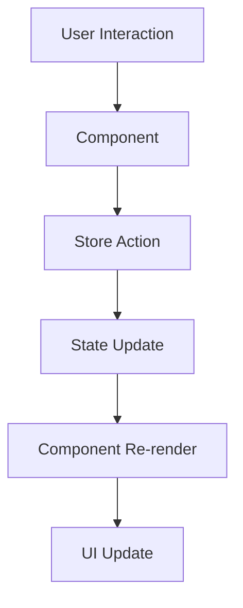
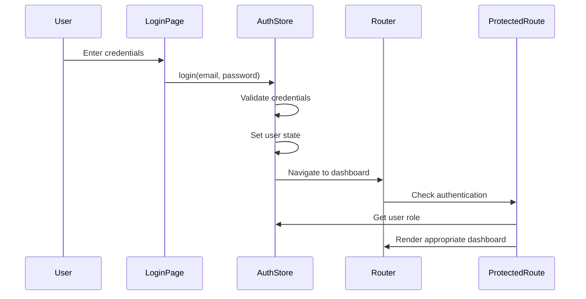
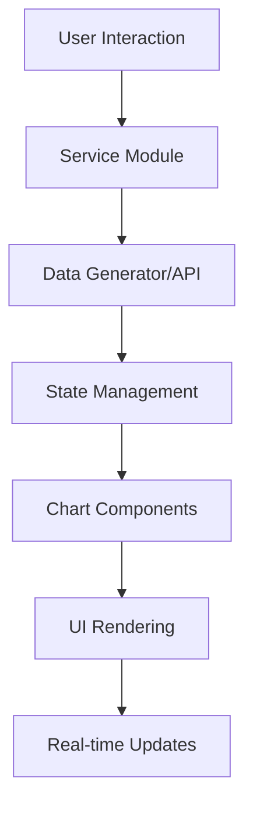

# 🏗️ Arquitectura del Proyecto

## 📋 Visión General

El Panel de Administración de Balnearios está construido con una arquitectura moderna de React que prioriza la escalabilidad, mantenibilidad y experiencia de usuario. Utiliza un enfoque component-driven con gestión de estado centralizada y diseño responsivo ultra granular.

## 🎯 Principios Arquitectónicos

### 1. **Separation of Concerns**
- **Presentación**: Componentes React puros
- **Lógica de Negocio**: Custom hooks y stores
- **Estado**: Zustand stores centralizados
- **Estilos**: Tailwind CSS con sistema de diseño

### 2. **Component-Driven Development**
- Componentes reutilizables y modulares
- Props tipadas con TypeScript
- Composición sobre herencia
- Single Responsibility Principle

### 3. **Mobile-First Responsive Design**
- Breakpoints ultra granulares
- Touch-friendly interfaces
- Progressive enhancement
- Adaptive layouts

### 4. **Type Safety**
- TypeScript estricto en toda la aplicación
- Interfaces bien definidas
- Type guards para validación
- Autocompletado y refactoring seguro

---

## 🗂️ Estructura de Directorios

```
src/
├── components/              # Componentes reutilizables
│   ├── charts/             # Gráficos y visualizaciones
│   │   ├── DailyChart.tsx
│   │   └── MonthlyChart.tsx
│   ├── dashboards/         # Componentes específicos del dashboard
│   │   ├── SummaryCards.tsx
│   │   └── WaterParksTable.tsx
│   ├── layout/             # Componentes de layout
│   │   ├── DashboardLayout.tsx
│   │   ├── Header.tsx
│   │   └── Sidebar.tsx
│   ├── tables/             # Componentes de tablas
│   │   └── CheckersTable.tsx
│   └── ProtectedRoute.tsx  # HOC para protección de rutas
├── pages/                  # Páginas principales
│   ├── LoginPage.tsx
│   ├── AdminDashboard.tsx
│   ├── SuperAdminDashboard.tsx
│   ├── WaterParkDetail.tsx
│   ├── UserManagement.tsx
│   └── WaterParkManagement.tsx
├── stores/                 # Estado global (Zustand)
│   ├── authStore.ts
│   └── waterParksStore.ts
├── types/                  # Definiciones de tipos TypeScript
├── utils/                  # Utilidades y helpers
├── hooks/                  # Custom hooks
├── constants/              # Constantes de la aplicación
├── styles/                 # Estilos globales
├── main.tsx               # Punto de entrada
├── App.tsx                # Componente raíz
└── index.css              # Estilos base
```

---

## 🔄 Flujo de Datos

### Arquitectura Unidireccional



### Gestión de Estado

#### 1. **Local State** (useState)
```typescript
// Para estado específico del componente
const [isModalOpen, setIsModalOpen] = useState(false);
const [formData, setFormData] = useState(initialData);
```

#### 2. **Global State** (Zustand)
```typescript
// Para estado compartido entre componentes
const { user, isAuthenticated } = useAuthStore();
const { waterParks, loading } = useWaterParksStore();
```

#### 3. **URL State** (React Router)
```typescript
// Para estado derivado de la URL
const { id } = useParams();
const location = useLocation();
```

---

## 🧩 Patrones de Diseño Implementados

### 1. **Container/Presentational Pattern**

#### Container Components
```typescript
// Lógica de negocio y estado
const WaterParkDetail: React.FC = () => {
  const { id } = useParams();
  const { fetchWaterParkDetails } = useWaterParksStore();
  
  const [waterPark, setWaterPark] = useState<WaterPark>();
  
  useEffect(() => {
    const details = fetchWaterParkDetails(id);
    setWaterPark(details);
  }, [id]);
  
  return <WaterParkDetailView waterPark={waterPark} />;
};
```

#### Presentational Components
```typescript
// Solo presentación, sin lógica de negocio
interface WaterParkDetailViewProps {
  waterPark: WaterPark;
}

const WaterParkDetailView: React.FC<WaterParkDetailViewProps> = ({ waterPark }) => {
  return (
    <div>
      <h1>{waterPark.name}</h1>
      {/* Solo UI */}
    </div>
  );
};
```

### 2. **Higher-Order Component (HOC) Pattern**

```typescript
// ProtectedRoute como HOC
const ProtectedRoute: React.FC<ProtectedRouteProps> = ({ 
  children, 
  requiredRole 
}) => {
  const { isAuthenticated, userRole } = useAuthStore();
  
  if (!isAuthenticated) {
    return <Navigate to="/login" replace />;
  }
  
  if (userRole !== requiredRole && userRole !== 'superadmin') {
    return <Navigate to="/admin" replace />;
  }
  
  return <>{children}</>;
};
```

### 3. **Compound Component Pattern**

```typescript
// DashboardLayout como compound component
const DashboardLayout: React.FC<DashboardLayoutProps> = ({ children, title }) => {
  return (
    <div className="dashboard-layout">
      <Sidebar />
      <div className="main-content">
        <Header title={title} />
        <main>{children}</main>
      </div>
    </div>
  );
};
```

### 4. **Render Props Pattern**

```typescript
// Para componentes de datos reutilizables
interface DataFetcherProps<T> {
  fetchData: () => Promise<T>;
  children: (data: T | null, loading: boolean, error: string | null) => React.ReactNode;
}

const DataFetcher = <T,>({ fetchData, children }: DataFetcherProps<T>) => {
  const [data, setData] = useState<T | null>(null);
  const [loading, setLoading] = useState(true);
  const [error, setError] = useState<string | null>(null);
  
  // Lógica de fetch...
  
  return <>{children(data, loading, error)}</>;
};
```

---

## 🔐 Arquitectura de Autenticación

### Flujo de Autenticación



### Roles y Permisos

```typescript
type UserRole = 'admin' | 'superadmin';

interface User {
  id: string;
  email: string;
  name: string;
  role: UserRole;
  waterParkId?: string; // Solo para admins
}

// Matriz de permisos
const PERMISSIONS = {
  admin: {
    canViewOwnWaterPark: true,
    canEditOwnWaterPark: true,
    canViewAllWaterParks: false,
    canManageUsers: false,
  },
  superadmin: {
    canViewOwnWaterPark: true,
    canEditOwnWaterPark: true,
    canViewAllWaterParks: true,
    canManageUsers: true,
    canManageWaterParks: true,
  }
};
```

---

## 📱 Arquitectura Responsiva

### Sistema de Breakpoints

```typescript
const BREAKPOINTS = {
  'mobile-s': '320px',    // Móviles muy pequeños
  'mobile-m': '375px',    // Móviles medianos
  'mobile-l': '425px',    // Móviles grandes
  'tablet': '768px',      // Tablets
  'laptop': '1024px',     // Laptops
  'laptop-l': '1440px',   // Laptops grandes
  '4k': '2560px',         // Pantallas 4K
} as const;
```

### Configuración Responsiva Adaptativa

```typescript
const getResponsiveConfig = () => {
  const width = window.innerWidth;
  
  if (width < 375) return MOBILE_SMALL_CONFIG;
  if (width < 640) return MOBILE_CONFIG;
  if (width < 768) return TABLET_CONFIG;
  if (width < 1024) return LAPTOP_CONFIG;
  return DESKTOP_CONFIG;
};
```

### Componentes Adaptativos

```typescript
// Componente que se adapta automáticamente
const ResponsiveCard: React.FC<CardProps> = ({ children }) => {
  const [config, setConfig] = useState(getResponsiveConfig());
  
  useEffect(() => {
    const handleResize = () => setConfig(getResponsiveConfig());
    window.addEventListener('resize', handleResize);
    return () => window.removeEventListener('resize', handleResize);
  }, []);
  
  return (
    <div className={`card ${config.cardClass}`}>
      {children}
    </div>
  );
};
```

---

## 🎨 Arquitectura de Estilos

### Sistema de Diseño en Capas

```css
/* 1. Base Layer - Reset y variables */
@layer base {
  html { font-family: 'Inter', sans-serif; }
  body { @apply bg-gradient-to-br from-sky-light via-white to-blue-soft/20; }
}

/* 2. Components Layer - Componentes reutilizables */
@layer components {
  .btn { @apply inline-flex items-center justify-center transition-all; }
  .card { @apply bg-white/90 backdrop-blur-md shadow-soft; }
}

/* 3. Utilities Layer - Utilidades específicas */
@layer utilities {
  .gradient-text { @apply bg-gradient-to-r from-midnight-blue to-sky-muted bg-clip-text text-transparent; }
}
```

### Tokens de Diseño

```typescript
const DESIGN_TOKENS = {
  colors: {
    primary: {
      50: '#C1E8FF',
      500: '#1B3B6F',
      900: '#021024',
    }
  },
  spacing: {
    xs: '0.25rem',
    sm: '0.5rem',
    md: '1rem',
    lg: '1.5rem',
    xl: '2rem',
  },
  typography: {
    fontSizes: {
      xs: '0.75rem',
      sm: '0.875rem',
      base: '1rem',
      lg: '1.125rem',
    }
  }
} as const;
```

---

## 🔄 Arquitectura de Estado

### Zustand Store Pattern

```typescript
interface StoreState {
  // Estado
  data: DataType[];
  loading: boolean;
  error: string | null;
  
  // Acciones síncronas
  setData: (data: DataType[]) => void;
  setLoading: (loading: boolean) => void;
  setError: (error: string | null) => void;
  
  // Acciones asíncronas
  fetchData: () => Promise<void>;
  createItem: (item: Omit<DataType, 'id'>) => Promise<void>;
  updateItem: (id: string, data: Partial<DataType>) => Promise<void>;
  deleteItem: (id: string) => Promise<void>;
}

const useDataStore = create<StoreState>()((set, get) => ({
  data: [],
  loading: false,
  error: null,
  
  setData: (data) => set({ data }),
  setLoading: (loading) => set({ loading }),
  setError: (error) => set({ error }),
  
  fetchData: async () => {
    set({ loading: true, error: null });
    try {
      const data = await api.fetchData();
      set({ data, loading: false });
    } catch (error) {
      set({ error: error.message, loading: false });
    }
  },
  
  // ... más acciones
}));
```

### Persistencia de Estado

```typescript
// AuthStore con persistencia
const useAuthStore = create<AuthState>()(
  persist(
    (set) => ({
      user: null,
      isAuthenticated: false,
      login: async (email, password) => {
        // Lógica de login
        set({ user, isAuthenticated: true });
      },
      logout: () => set({ user: null, isAuthenticated: false }),
    }),
    {
      name: 'auth-storage',
      partialize: (state) => ({ 
        user: state.user, 
        isAuthenticated: state.isAuthenticated 
      }),
    }
  )
);
```

---

## 🚀 Arquitectura de Performance

### Code Splitting

```typescript
// Lazy loading de páginas
const AdminDashboard = lazy(() => import('./pages/AdminDashboard'));
const SuperAdminDashboard = lazy(() => import('./pages/SuperAdminDashboard'));

// Suspense wrapper
<Suspense fallback={<LoadingSpinner />}>
  <Routes>
    <Route path="/admin" element={<AdminDashboard />} />
    <Route path="/superadmin" element={<SuperAdminDashboard />} />
  </Routes>
</Suspense>
```

### Memoización Estratégica

```typescript
// Componentes memoizados
const ExpensiveComponent = React.memo<Props>(({ data }) => {
  const processedData = useMemo(() => {
    return data.map(item => expensiveTransformation(item));
  }, [data]);
  
  const handleClick = useCallback((id: string) => {
    // Lógica del click
  }, []);
  
  return <div>{/* Render */}</div>;
});
```

### Optimización de Re-renders

```typescript
// Selectores específicos para evitar re-renders innecesarios
const useUserName = () => useAuthStore(state => state.user?.name);
const useIsAuthenticated = () => useAuthStore(state => state.isAuthenticated);

// En lugar de
const { user, isAuthenticated } = useAuthStore(); // Re-render en cualquier cambio
```

---

## 🧪 Arquitectura de Testing (Preparada)

### Estructura de Tests

```
src/
├── components/
│   ├── __tests__/
│   │   ├── DailyChart.test.tsx
│   │   └── SummaryCards.test.tsx
├── pages/
│   ├── __tests__/
│   │   ├── LoginPage.test.tsx
│   │   └── AdminDashboard.test.tsx
├── stores/
│   ├── __tests__/
│   │   ├── authStore.test.ts
│   │   └── waterParksStore.test.ts
└── utils/
    └── __tests__/
        └── testUtils.tsx
```

### Testing Patterns

```typescript
// Test utilities
export const renderWithProviders = (
  ui: React.ReactElement,
  options?: RenderOptions
) => {
  return (props: P) => {
    const { mode } = useThemeStore();
    const enhancedConfig = {
      ...config,
      theme: mode,
      responsive: true
    };
    
    return <WrappedComponent {...props} config={enhancedConfig} />;
  };
};

// Uso
const EnhancedAreaChart = withChartConfig(AreaChart, chartConfigs.snacks.hourlyChart);
```

### Sistema de Estados Mejorado

#### Estados Específicos por Módulo
```typescript
// Estados especializados para cada servicio
interface SnacksState {
  sales: SnackSale[];
  hourlySales: HourlySales[];
  topProducts: TopProduct[];
  stats: SnacksStats;
  loading: boolean;
  error: string | null;
  
  // Acciones específicas
  generateHourlyData: () => void;
  calculateTopProducts: () => void;
  updateRealTimeStats: () => void;
}

interface StoreState {
  sales: StoreSale[];
  products: StoreProduct[];
  dailyTrends: DailySalesData[];
  weeklyTrends: WeeklySalesData[];
  stats: StoreStats;
  loading: boolean;
  error: string | null;
  
  // Acciones específicas
  calculateGrowthMetrics: () => void;
  generateTrendAnalysis: () => void;
  updateInventoryStats: () => void;
}
```

### Arquitectura de Tiempo Real

#### Sistema de Actualización Automática
```typescript
// Hook personalizado para actualizaciones en tiempo real
const useRealTimeUpdates = (interval: number = 30000) => {
  const [lastUpdate, setLastUpdate] = useState(Date.now());
  
  useEffect(() => {
    const timer = setInterval(() => {
      setLastUpdate(Date.now());
    }, interval);
    
    return () => clearInterval(timer);
  }, [interval]);
  
  return lastUpdate;
};

// Uso en componentes
const SnacksManagement = () => {
  const lastUpdate = useRealTimeUpdates(30000); // 30 segundos
  
  useEffect(() => {
    // Actualizar datos cuando cambie lastUpdate
    refreshData();
  }, [lastUpdate]);
};
```

### Arquitectura de Rendimiento

#### Optimizaciones Específicas
```typescript
// Memoización de cálculos costosos
const ExpensiveMetricsCalculation = React.memo(({ sales }: { sales: Sale[] }) => {
  const metrics = useMemo(() => {
    return calculateComplexMetrics(sales);
  }, [sales]);
  
  return <MetricsDisplay metrics={metrics} />;
});

// Lazy loading de gráficas
const LazyPieChart = lazy(() => import('./charts/PieChart'));
const LazyAreaChart = lazy(() => import('./charts/AreaChart'));

// Virtualización para listas grandes
const VirtualizedSalesList = ({ sales }: { sales: Sale[] }) => {
  return (
    <FixedSizeList
      height={400}
      itemCount={sales.length}
      itemSize={60}
      itemData={sales}
    >
      {SaleItem}
    </FixedSizeList>
  );
};
```

### Arquitectura de Temas Mejorada

#### Temas Específicos por Módulo
```typescript
// Temas especializados para cada servicio
export const serviceThemes = {
  restaurant: {
    primary: '#1B3B6F',
    secondary: '#5483B3',
    accent: '#7DA0CA',
    background: 'from-[#052659]/40 to-[#1B3B6F]/30',
    icon: 'ChefHat'
  },
  
  snacks: {
    primary: '#5483B3',
    secondary: '#7DA0CA',
    accent: '#C1E8FF',
    background: 'from-[#1B3B6F]/40 to-[#5483B3]/30',
    icon: 'Coffee'
  },
  
  store: {
    primary: '#7DA0CA',
    secondary: '#C1E8FF',
    accent: '#FFFFFF',
    background: 'from-[#5483B3]/40 to-[#7DA0CA]/30',
    icon: 'ShoppingBag'
  }
};

// Hook para tema contextual
const useServiceTheme = (service: 'restaurant' | 'snacks' | 'store') => {
  const { mode } = useThemeStore();
  return {
    ...serviceThemes[service],
    mode,
    isDark: mode === 'dark'
  };
};
```

### Arquitectura de Testing (Preparada)

#### Tests Específicos por Módulo
```typescript
// Tests para generadores de datos
describe('SnacksDataGenerator', () => {
  it('should generate realistic hourly sales data', () => {
    const generator = new SnacksDataGenerator();
    const hourlySales = generator.generateHourlySales();
    
    expect(hourlySales).toHaveLength(13); // 8 AM to 8 PM
    expect(hourlySales[0].hour).toBe('8:00');
  });
});

// Tests para calculadores de métricas
describe('MetricsCalculator', () => {
  it('should calculate growth percentage correctly', () => {
    const growth = MetricsCalculator.calculateGrowth(120, 100);
    expect(growth).toBe(20);
  });
});

// Tests para componentes de gráficas
describe('HourlySalesChart', () => {
  it('should render chart with correct data points', () => {
    const mockData = generateMockHourlySales();
    render(<HourlySalesChart data={mockData} />);
    
    expect(screen.getByText('Ventas por Hora')).toBeInTheDocument();
  });
});
```

### Arquitectura de Escalabilidad

#### Preparación para Microservicios
```typescript
// Interfaces preparadas para APIs independientes
interface ServiceAPI {
  baseURL: string;
  endpoints: Record<string, string>;
  auth: AuthConfig;
}

const servicesConfig: Record<string, ServiceAPI> = {
  restaurant: {
    baseURL: process.env.RESTAURANT_API_URL,
    endpoints: {
      notes: '/notes',
      tables: '/tables',
      stats: '/stats'
    },
    auth: { type: 'bearer' }
  },
  
  snacks: {
    baseURL: process.env.SNACKS_API_URL,
    endpoints: {
      sales: '/sales',
      products: '/products',
      analytics: '/analytics'
    },
    auth: { type: 'bearer' }
  }
};
```

Esta arquitectura expandida proporciona una base sólida para los nuevos módulos de servicios de alimentación, manteniendo la consistencia con el diseño existente mientras introduce funcionalidades avanzadas de análisis y métricas en tiempo real.
  const Wrapper: React.FC<{ children: React.ReactNode }> = ({ children }) => (
    <BrowserRouter>
      <QueryClient>
        {children}
      </QueryClient>
    </BrowserRouter>
  );
  
  return render(ui, { wrapper: Wrapper, ...options });
};

// Component tests
describe('SummaryCards', () => {
  it('should display correct metrics', () => {
    renderWithProviders(<SummaryCards />);
    expect(screen.getByText('Tickets Activos')).toBeInTheDocument();
  });
});

// Store tests
describe('authStore', () => {
  it('should authenticate user correctly', async () => {
    const { login } = useAuthStore.getState();
    await login('admin@example.com', 'password');
    expect(useAuthStore.getState().isAuthenticated).toBe(true);
  });
});
```

---

## 🔮 Arquitectura Futura

### Preparación para Escalabilidad

#### 1. **Micro-frontends Ready**
```typescript
// Estructura preparada para micro-frontends
const ModuleLoader = lazy(() => import('@waterparks/user-management'));
const AnotherModule = lazy(() => import('@waterparks/analytics'));
```

#### 2. **API Integration Ready**
```typescript
// Capa de abstracción para APIs
interface ApiClient {
  get<T>(url: string): Promise<T>;
  post<T>(url: string, data: unknown): Promise<T>;
  put<T>(url: string, data: unknown): Promise<T>;
  delete(url: string): Promise<void>;
}

const apiClient: ApiClient = {
  // Implementación con fetch/axios
};
```

#### 3. **Real-time Updates Ready**
```typescript
// WebSocket integration preparada
const useRealTimeData = (endpoint: string) => {
  const [data, setData] = useState(null);
  
  useEffect(() => {
    const ws = new WebSocket(`ws://api.example.com/${endpoint}`);
    ws.onmessage = (event) => setData(JSON.parse(event.data));
    return () => ws.close();
  }, [endpoint]);
  
  return data;
};
```

---

Esta arquitectura proporciona una base sólida, escalable y mantenible para el crecimiento futuro del proyecto, manteniendo la flexibilidad para adaptarse a nuevos requerimientos y tecnologías.

---

## 🍽️ Arquitectura de Servicios de Alimentación

### Módulos de Servicios de Alimentación

```
src/pages/
├── RestaurantManagement.tsx    # Gestión de restaurante con etiquetas
├── SnacksManagement.tsx       # Gestión de snacks con gráficas
└── StoreManagement.tsx        # Gestión de tienda con métricas
```

### Patrón de Arquitectura Implementado

#### 1. **Separation of Concerns Mejorada**
```typescript
// Cada módulo tiene responsabilidades específicas

// RestaurantManagement: Gestión de notas y mesas
interface RestaurantModule {
  noteManagement: NoteService;
  tableTracking: TableService;
  revenueCalculation: RevenueService;
}

// SnacksManagement: Análisis de ventas por hora
interface SnacksModule {
  salesTracking: SalesService;
  hourlyAnalytics: AnalyticsService;
  productRanking: RankingService;
}

// StoreManagement: Métricas avanzadas y tendencias
interface StoreModule {
  inventoryTracking: InventoryService;
  trendAnalysis: TrendService;
  growthCalculation: GrowthService;
}
```

#### 2. **Data Flow Architecture**


### Generadores de Datos Mock

#### Patrón Factory para Datos
```typescript
// Patrón Factory implementado para cada servicio
abstract class DataGenerator {
  abstract generateSales(): Sale[];
  abstract generateStats(): Stats;
  abstract generateTrends(): Trend[];
}

class SnacksDataGenerator extends DataGenerator {
  generateSales(): SnackSale[] {
    // Lógica específica para snacks
  }
  
  generateHourlySales(): HourlySales[] {
    // Datos agrupados por hora
  }
  
  generateTopProducts(): TopProduct[] {
    // Productos más vendidos
  }
}

class StoreDataGenerator extends DataGenerator {
  generateSales(): StoreSale[] {
    // Lógica específica para tienda
  }
  
  generateGrowthMetrics(): GrowthMetrics {
    // Cálculos de crecimiento
  }
  
  generateCategoryStats(): CategoryStats[] {
    // Estadísticas por categoría
  }
}
```

### Sistema de Métricas Avanzadas

#### Calculadores de Métricas
```typescript
// Sistema modular de cálculo de métricas
class MetricsCalculator {
  static calculateGrowth(current: number, previous: number): number {
    return previous > 0 ? ((current - previous) / previous) * 100 : 0;
  }
  
  static calculateAverageTicket(revenue: number, sales: number): number {
    return sales > 0 ? revenue / sales : 0;
  }
  
  static calculateTrend(data: number[]): 'up' | 'down' | 'stable' {
    // Lógica de análisis de tendencias
  }
}

// Uso en componentes
const dailyGrowth = MetricsCalculator.calculateGrowth(todayRevenue, yesterdayRevenue);
const averageTicket = MetricsCalculator.calculateAverageTicket(revenue, sales);
```

### Arquitectura de Gráficas

#### Configuración Modular de Charts
```typescript
// Configuraciones reutilizables para gráficas
export const chartConfigs = {
  snacks: {
    hourlyChart: {
      type: 'area',
      gradient: 'salesGradient',
      colors: ['#5483B3', '#7DA0CA'],
      strokeWidth: 3
    },
    
    weeklyChart: {
      type: 'bar',
      colors: ['#1B3B6F'],
      radius: [4, 4, 0, 0]
    },
    
    pieChart: {
      type: 'pie',
      colors: ['#1B3B6F', '#5483B3', '#7DA0CA', '#C1E8FF', '#052659'],
      outerRadius: 80
    }
  },
  
  store: {
    lineChart: {
      type: 'line',
      strokeWidth: 3,
      dotSize: 4,
      activeDotSize: 6
    },
    
    barChart: {
      type: 'bar',
      colors: ['#1B3B6F'],
      radius: [4, 4, 0, 0]
    }
  }
};
```

#### Componentes de Gráficas Reutilizables
```typescript
// HOC para gráficas con configuración automática
const withChartConfig = <P extends object>(
  WrappedComponent: React.ComponentType<P>,
  config: ChartConfig